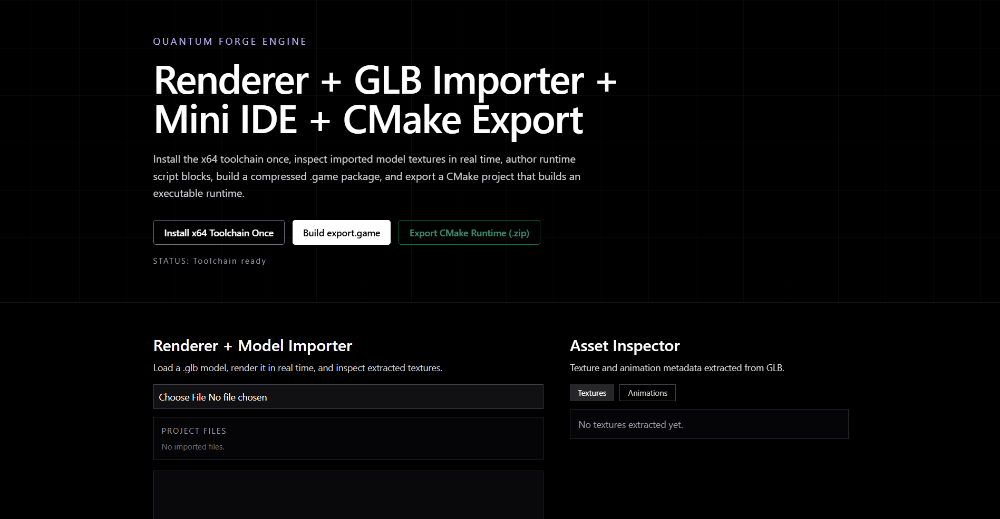
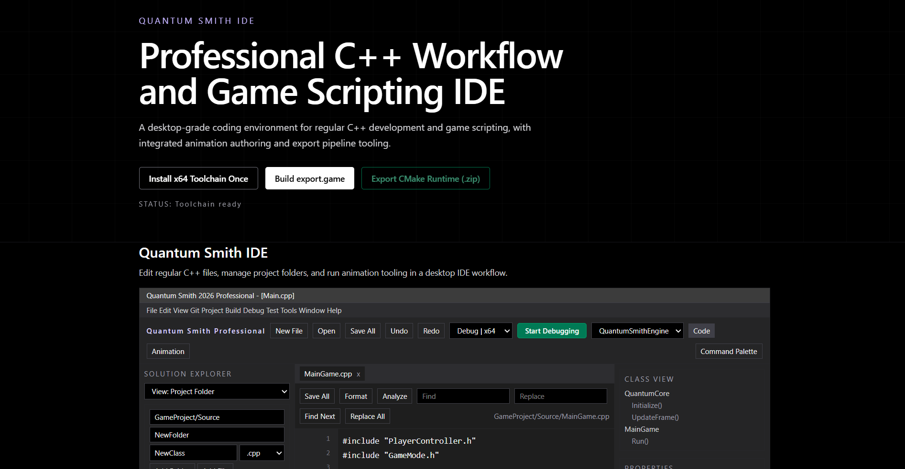

# Quantum Forge

**A hybrid C++ + TypeScript game engine with a built-in IDE called Quantum Smith.**

Quantum Forge is an ambitious, early-stage, passion-driven game engine that aims to blend the performance of C++ with the rapid development capabilities of modern web technologies. It is designed for developers who want low-level control, fast prototyping, and a unique workflow that doesn't force you into a massive bloated engine like Unreal or Unity.

> **Warning**: This project is in **very early development**. Expect bugs, missing features, and occasional chaos.

## Philosophy

Quantum Forge was born from the idea of **"Quantum"** (fast, modern, lightweight) and **"Forge"** (building something powerful from raw materials). The built-in IDE is named **Quantum Smith** — a lightweight code editor inside the engine, though we highly recommend using Visual Studio 2022 or any external IDE for serious development.

## Current Features

- **High-Performance 3D Renderer**
  - Full glTF 2.0 / GLB model support
  - Mixamo / mixamorig skeleton & animation system
  - Real-time viewport with grid, stats, and model inspection

- **Quantum Smith IDE**
  - Built-in code tabs (MainGame.cpp, GameMode.h, etc.)
  - Read-only reference view (real editing happens in external IDE or planned full editor)
  - Integrated with the renderer for live preview

- **Desktop Launcher**
  - Quantum_Smith.exe — One-click solution
  - Automatically runs 
   npm install, 
   npm audit fix --force, 
    npm run dev
  - Opens the editor in a browserless window (Electron-style)

- **Custom Binary Format (.game)**
  - Custom packer/exporter
  - **Binary Layout Inspector** — View sections, compression, offsets, stored vs raw data
  - Designed for optimized game distribution

- **C++ First Workflow**
  - Core logic in C++ with CMake
  - Easy integration with external IDEs (VS 2022 recommended)

## Tech Stack (The Suffering Part)

- **Frontend**: TypeScript + Vite + React (or similar)
- **3D Engine**: Three.js (or custom WebGL layer)
- **Backend / Runtime**: C++17/20 + CMake
- **Build System**: CMake for desktop, npm scripts for web
- **Asset Pipeline**: glTF 2.0 focused
- **Dependencies**: A LOT, cmake , node.js , python , mvsc build tools , and some other stuff I am too lazy to list (I know, it's being optimized)

## Installation & Quick Start

1. Clone the repository:
   git clone https://github.com/Ai-finder-for-api/engine-v1.git
   cd engine-v1

Easiest way — Use the desktop launcher:
first run:

cmake -B build -S . -G "Visual Studio 17 2022" -A x64
cmake --build build --config Debug (or if you want the realese version - cmake --build build --config Release
Run Quantum_Smith.exe (located in desktop folder after build)

Manual way:
npm install
npm run dev
Desktop Build:Bashcd desktop
cmake -B build -S .
cmake --build build --config Release

Project Structure (ignore the nodes module and build)
engine-v1/
├───desktop
│   ├───build
│   │   ├───ALL_BUILD.dir
│   │   │   ├───Debug
│   │   │   ├───MinSizeRel
│   │   │   ├───Release
│   │   │   └───RelWithDebInfo
│   │   ├───bin
│   │   │   └───Debug
│   │   │       └───web
│   │   │           └───images
│   │   ├───CMakeFiles
│   │   │   ├───4.3.3
│   │   │   │   ├───CompilerIdCXX
│   │   │   │   │   ├───Debug
│   │   │   │   │   │   └───CompilerIdCXX.tlog
│   │   │   │   │   └───tmp
│   │   │   │   ├───VCTargetsPath
│   │   │   │   │   └───x64
│   │   │   │   │       └───Debug
│   │   │   │   │           └───VCTargetsPath.tlog
│   │   │   │   └───x64
│   │   │   │       └───Debug
│   │   │   ├───6de0352acea01b941df9c8d6fb63875e
│   │   │   ├───CMakeScratch
│   │   │   └───pkgRedirects
│   │   ├───Debug
│   │   ├───Quantum_Forge_engine.dir
│   │   │   ├───Debug
│   │   │   │   ├───microsoft
│   │   │   │   │   └───STL
│   │   │   │   ├───Quantum_.63D8E2BC.tlog
│   │   │   │   └───Quantum_.63D8E2BC_MD.tlog
│   │   │   ├───MinSizeRel
│   │   │   ├───Release
│   │   │   └───RelWithDebInfo
│   │   ├───Quantum_Smith.dir
│   │   │   ├───Debug
│   │   │   │   ├───microsoft
│   │   │   │   │   └───STL
│   │   │   │   ├───Quantum_Smith.tlog
│   │   │   │   └───Quantum_Smith_MD.tlog
│   │   │   ├───MinSizeRel
│   │   │   ├───Release
│   │   │   └───RelWithDebInfo
│   │   ├───x64
│   │   │   └───Debug
│   │   │       ├───ALL_BUILD
│   │   │       │   └───ALL_BUILD.tlog
│   │   │       └───ZERO_CHECK
│   │   │           └───ZERO_CHECK.tlog
│   │   └───ZERO_CHECK.dir
│   │       ├───Debug
│   │       ├───MinSizeRel
│   │       ├───Release
│   │       └───RelWithDebInfo
│   ├───include
│   └───src
├───dist
│   └───images
├───ecosystem
│   ├───engine-runtime
│   │   ├───include
│   │   ├───src
│   │   └───tools
│   ├───go
│   │   └───sync_server
│   ├───native
│   │   ├───animation
│   │   ├───ecs
│   │   └───render
│   ├───node
│   ├───odin
│   ├───python
│   ├───rust
│   │   └───asset_pipeline
│   │       └───src
│   ├───specs
│   ├───web
│   │   └───ide
│   │       └───app
│   └───zig
├───node_modules
│   ├───.bin
│   ├───.vite
│   │   └───deps
│   ├───.vite-temp
│   ├───@babel
│   │   ├───code-frame
│   │   │   └───lib
│   │   ├───compat-data
│   │   │   └───data
│   │   ├───core
│   │   │   ├───lib
│   │   │   │   ├───config
│   │   │   │   │   ├───files
│   │   │   │   │   ├───helpers
│   │   │   │   │   └───validation
│   │   │   │   ├───errors
│   │   │   │   ├───gensync-utils
│   │   │   │   ├───parser
│   │   │   │   │   └───util
│   │   │   │   ├───tools
│   │   │   │   ├───transformation
│   │   │   │   │   ├───file
│   │   │   │   │   └───util
│   │   │   │   └───vendor
│   │   │   └───src
│   │   │       ├───config
│   │   │       │   └───files
│   │   │       └───transformation
│   │   ├───generator
│   │   │   └───lib
│   │   │       ├───generators
│   │   │       └───node
│   │   ├───helper-compilation-targets
│   │   │   └───lib
│   │   ├───helper-globals
│   │   │   └───data
│   │   ├───helper-module-imports
│   │   │   └───lib
│   │   ├───helper-module-transforms
│   │   │   └───lib
│   │   ├───helper-plugin-utils
│   │   │   └───lib
│   │   ├───helper-string-parser
│   │   │   └───lib
│   │   ├───helper-validator-identifier
│   │   │   └───lib
│   │   ├───helper-validator-option
│   │   │   └───lib
│   │   ├───helpers
│   │   │   └───lib
│   │   │       └───helpers
│   │   ├───parser
│   │   │   ├───bin
│   │   │   ├───lib
│   │   │   └───typings
│   │   ├───plugin-transform-react-jsx-self
│   │   │   └───lib
│   │   ├───plugin-transform-react-jsx-source
│   │   │   └───lib
│   │   ├───template
│   │   │   └───lib
│   │   ├───traverse
│   │   │   └───lib
│   │   │       ├───path
│   │   │       │   ├───inference
│   │   │       │   └───lib
│   │   │       └───scope
│   │   │           └───lib
│   │   └───types
│   │       └───lib
│   │           ├───asserts
│   │           │   └───generated
│   │           ├───ast-types
│   │           │   └───generated
│   │           ├───builders
│   │           │   ├───flow
│   │           │   ├───generated
│   │           │   ├───react
│   │           │   └───typescript
│   │           ├───clone
│   │           ├───comments
│   │           ├───constants
│   │           │   └───generated
│   │           ├───converters
│   │           ├───definitions
│   │           ├───modifications
│   │           │   ├───flow
│   │           │   └───typescript
│   │           ├───retrievers
│   │           ├───traverse
│   │           ├───utils
│   │           │   └───react
│   │           └───validators
│   │               ├───generated
│   │               └───react
│   ├───@dimforge
│   │   └───rapier3d-compat
│   │       ├───control
│   │       ├───dynamics
│   │       ├───geometry
│   │       └───pipeline
│   ├───@esbuild
│   ├───@jridgewell
│   │   ├───gen-mapping
│   │   │   ├───dist
│   │   │   │   └───types
│   │   │   ├───src
│   │   │   └───types
│   │   ├───remapping
│   │   │   ├───dist
│   │   │   ├───src
│   │   │   └───types
│   │   ├───resolve-uri
│   │   │   └───dist
│   │   │       └───types
│   │   ├───sourcemap-codec
│   │   │   ├───dist
│   │   │   ├───src
│   │   │   └───types
│   │   └───trace-mapping
│   │       ├───dist
│   │       ├───src
│   │       └───types
│   ├───@oneidentity
│   │   └───zstd-js
│   │       ├───asm
│   │       │   └───decompress
│   │       ├───decompress
│   │       ├───lib
│   │       ├───readme
│   │       │   ├───data
│   │       │   ├───logo
│   │       │   └───plots
│   │       └───wasm
│   │           └───decompress
│   ├───@oxc-project
│   │   └───types
│   ├───@rolldown
│   │   ├───binding-win32-x64-msvc
│   │   └───pluginutils
│   │       └───dist
│   │           └───filter
│   ├───@rollup
│   ├───@tailwindcss
│   │   ├───node
│   │   │   ├───dist
│   │   │   └───node_modules
│   │   │       └───tailwindcss
│   │   │           └───dist
│   │   ├───oxide
│   │   ├───oxide-win32-x64-msvc
│   │   └───vite
│   │       ├───dist
│   │       └───node_modules
│   │           └───tailwindcss
│   │               └───dist
│   ├───@tweenjs
│   │   └───tween.js
│   │       └───dist
│   ├───@types
│   │   ├───babel__core
│   │   ├───babel__generator
│   │   ├───babel__template
│   │   ├───babel__traverse
│   │   ├───emscripten
│   │   ├───node
│   │   │   ├───assert
│   │   │   ├───compatibility
│   │   │   ├───dns
│   │   │   ├───fs
│   │   │   ├───readline
│   │   │   ├───stream
│   │   │   ├───timers
│   │   │   ├───ts5.6
│   │   │   └───web-globals
│   │   ├───react
│   │   │   └───ts5.0
│   │   ├───react-dom
│   │   │   └───test-utils
│   │   ├───stats.js
│   │   ├───three
│   │   │   ├───build
│   │   │   ├───examples
│   │   │   │   └───jsm
│   │   │   │       ├───animation
│   │   │   │       ├───capabilities
│   │   │   │       ├───controls
│   │   │   │       ├───csm
│   │   │   │       ├───curves
│   │   │   │       ├───effects
│   │   │   │       ├───environments
│   │   │   │       ├───exporters
│   │   │   │       ├───geometries
│   │   │   │       ├───gpgpu
│   │   │   │       ├───helpers
│   │   │   │       ├───inspector
│   │   │   │       │   ├───extensions
│   │   │   │       │   │   └───tsl-graph
│   │   │   │       │   ├───tabs
│   │   │   │       │   └───ui
│   │   │   │       ├───interaction
│   │   │   │       ├───interactive
│   │   │   │       ├───libs
│   │   │   │       ├───lighting
│   │   │   │       ├───lights
│   │   │   │       ├───lines
│   │   │   │       │   └───webgpu
│   │   │   │       ├───loaders
│   │   │   │       ├───materials
│   │   │   │       ├───math
│   │   │   │       ├───misc
│   │   │   │       ├───modifiers
│   │   │   │       ├───objects
│   │   │   │       ├───physics
│   │   │   │       ├───postprocessing
│   │   │   │       ├───renderers
│   │   │   │       ├───shaders
│   │   │   │       ├───textures
│   │   │   │       ├───transpiler
│   │   │   │       ├───tsl
│   │   │   │       │   ├───display
│   │   │   │       │   ├───lighting
│   │   │   │       │   │   └───data
│   │   │   │       │   ├───math
│   │   │   │       │   ├───shadows
│   │   │   │       │   └───utils
│   │   │   │       ├───utils
│   │   │   │       └───webxr
│   │   │   └───src
│   │   │       ├───animation
│   │   │       │   └───tracks
│   │   │       ├───audio
│   │   │       ├───cameras
│   │   │       ├───core
│   │   │       ├───extras
│   │   │       │   ├───core
│   │   │       │   └───curves
│   │   │       ├───geometries
│   │   │       ├───helpers
│   │   │       ├───lights
│   │   │       │   └───webgpu
│   │   │       ├───loaders
│   │   │       │   └───nodes
│   │   │       ├───materials
│   │   │       │   └───nodes
│   │   │       │       └───manager
│   │   │       ├───math
│   │   │       │   └───interpolants
│   │   │       ├───nodes
│   │   │       │   ├───accessors
│   │   │       │   ├───code
│   │   │       │   ├───core
│   │   │       │   ├───display
│   │   │       │   ├───fog
│   │   │       │   ├───functions
│   │   │       │   │   ├───BSDF
│   │   │       │   │   └───material
│   │   │       │   ├───geometry
│   │   │       │   ├───gpgpu
│   │   │       │   ├───lighting
│   │   │       │   ├───materialx
│   │   │       │   │   └───lib
│   │   │       │   ├───math
│   │   │       │   ├───parsers
│   │   │       │   ├───pmrem
│   │   │       │   ├───procedural
│   │   │       │   ├───shapes
│   │   │       │   ├───tsl
│   │   │       │   └───utils
│   │   │       ├───objects
│   │   │       ├───renderers
│   │   │       │   ├───common
│   │   │       │   │   ├───extras
│   │   │       │   │   └───nodes
│   │   │       │   ├───shaders
│   │   │       │   ├───webgl
│   │   │       │   ├───webgl-fallback
│   │   │       │   │   ├───nodes
│   │   │       │   │   └───utils
│   │   │       │   ├───webgpu
│   │   │       │   │   ├───nodes
│   │   │       │   │   └───utils
│   │   │       │   └───webxr
│   │   │       ├───scenes
│   │   │       └───textures
│   │   └───webxr
│   ├───@vitejs
│   │   └───plugin-react
│   │       ├───dist
│   │       └───types
│   ├───baseline-browser-mapping
│   │   └───dist
│   ├───braces
│   │   └───lib
│   ├───browserslist
│   ├───caniuse-lite
│   │   ├───data
│   │   │   ├───features
│   │   │   └───regions
│   │   └───dist
│   │       ├───lib
│   │       └───unpacker
│   ├───clsx
│   │   └───dist
│   ├───convert-source-map
│   ├───core-util-is
│   │   └───lib
│   ├───csstype
│   ├───debug
│   │   └───src
│   ├───detect-libc
│   │   └───lib
│   ├───electron-to-chromium
│   ├───enhanced-resolve
│   │   └───lib
│   │       └───util
│   ├───escalade
│   │   ├───dist
│   │   └───sync
│   ├───fdir
│   │   └───dist
│   ├───fflate
│   │   ├───esm
│   │   ├───lib
│   │   └───umd
│   ├───fill-range
│   ├───framer-motion
│   │   ├───client
│   │   ├───dist
│   │   │   ├───cjs
│   │   │   └───es
│   │   │       ├───animation
│   │   │       │   ├───animate
│   │   │       │   ├───animators
│   │   │       │   │   └───waapi
│   │   │       │   ├───hooks
│   │   │       │   ├───optimized-appear
│   │   │       │   ├───sequence
│   │   │       │   │   └───utils
│   │   │       │   └───utils
│   │   │       ├───components
│   │   │       │   ├───AnimatePresence
│   │   │       │   ├───LayoutGroup
│   │   │       │   ├───LazyMotion
│   │   │       │   ├───MotionConfig
│   │   │       │   └───Reorder
│   │   │       │       └───utils
│   │   │       ├───context
│   │   │       │   └───MotionContext
│   │   │       ├───events
│   │   │       ├───gestures
│   │   │       │   ├───drag
│   │   │       │   │   └───utils
│   │   │       │   └───pan
│   │   │       ├───motion
│   │   │       │   ├───features
│   │   │       │   │   ├───animation
│   │   │       │   │   ├───layout
│   │   │       │   │   └───viewport
│   │   │       │   └───utils
│   │   │       ├───projection
│   │   │       ├───render
│   │   │       │   ├───components
│   │   │       │   │   ├───m
│   │   │       │   │   └───motion
│   │   │       │   ├───dom
│   │   │       │   │   ├───scroll
│   │   │       │   │   │   ├───offsets
│   │   │       │   │   │   └───utils
│   │   │       │   │   ├───utils
│   │   │       │   │   └───viewport
│   │   │       │   ├───html
│   │   │       │   │   └───utils
│   │   │       │   └───svg
│   │   │       │       └───utils
│   │   │       ├───utils
│   │   │       │   └───reduced-motion
│   │   │       └───value
│   │   │           ├───scroll
│   │   │           └───use-will-change
│   │   ├───dom
│   │   │   └───mini
│   │   ├───m
│   │   └───mini
│   ├───gensync
│   │   └───test
│   ├───graceful-fs
│   ├───immediate
│   │   ├───dist
│   │   └───lib
│   ├───inherits
│   ├───is-number
│   ├───isarray
│   ├───jiti
│   │   ├───dist
│   │   └───lib
│   ├───js-tokens
│   ├───jsesc
│   │   ├───bin
│   │   └───man
│   ├───json5
│   │   ├───dist
│   │   └───lib
│   ├───jszip
│   │   ├───.github
│   │   │   └───workflows
│   │   ├───dist
│   │   ├───lib
│   │   │   ├───generate
│   │   │   ├───nodejs
│   │   │   ├───reader
│   │   │   └───stream
│   │   └───vendor
│   ├───lie
│   │   ├───dist
│   │   └───lib
│   ├───lightningcss
│   │   └───node
│   ├───lightningcss-win32-x64-msvc
│   ├───lru-cache
│   ├───lz4js
│   │   └───test
│   │       └───cases
│   ├───magic-string
│   │   └───dist
│   ├───meshoptimizer
│   ├───micromatch
│   │   └───node_modules
│   │       └───picomatch
│   │           └───lib
│   ├───motion-dom
│   │   └───dist
│   │       ├───cjs
│   │       └───es
│   │           ├───animation
│   │           │   ├───animate
│   │           │   ├───drivers
│   │           │   ├───generators
│   │           │   │   └───utils
│   │           │   ├───interfaces
│   │           │   ├───keyframes
│   │           │   │   ├───offsets
│   │           │   │   └───utils
│   │           │   ├───optimized-appear
│   │           │   ├───utils
│   │           │   └───waapi
│   │           │       ├───easing
│   │           │       ├───supports
│   │           │       └───utils
│   │           ├───effects
│   │           │   ├───attr
│   │           │   ├───prop
│   │           │   ├───style
│   │           │   ├───svg
│   │           │   └───utils
│   │           ├───events
│   │           ├───frameloop
│   │           ├───gestures
│   │           │   ├───drag
│   │           │   │   └───state
│   │           │   ├───press
│   │           │   │   └───utils
│   │           │   └───utils
│   │           ├───layout
│   │           ├───projection
│   │           │   ├───animation
│   │           │   ├───geometry
│   │           │   ├───node
│   │           │   ├───shared
│   │           │   ├───styles
│   │           │   └───utils
│   │           ├───render
│   │           │   ├───dom
│   │           │   │   └───utils
│   │           │   ├───html
│   │           │   │   └───utils
│   │           │   ├───object
│   │           │   ├───svg
│   │           │   │   └───utils
│   │           │   └───utils
│   │           │       └───reduced-motion
│   │           ├───resize
│   │           ├───scroll
│   │           ├───stats
│   │           ├───utils
│   │           │   ├───mix
│   │           │   └───supports
│   │           ├───value
│   │           │   ├───types
│   │           │   │   ├───color
│   │           │   │   ├───complex
│   │           │   │   ├───maps
│   │           │   │   ├───numbers
│   │           │   │   └───utils
│   │           │   ├───utils
│   │           │   └───will-change
│   │           └───view
│   │               └───utils
│   ├───motion-utils
│   │   └───dist
│   │       ├───cjs
│   │       └───es
│   │           └───easing
│   │               ├───modifiers
│   │               └───utils
│   ├───ms
│   ├───nanoid
│   │   ├───.claude
│   │   ├───async
│   │   ├───bin
│   │   ├───non-secure
│   │   └───url-alphabet
│   ├───node-releases
│   │   └───data
│   │       ├───processed
│   │       └───release-schedule
│   ├───pako
│   │   ├───dist
│   │   └───lib
│   │       ├───utils
│   │       └───zlib
│   ├───picocolors
│   ├───picomatch
│   │   └───lib
│   ├───postcss
│   │   └───lib
│   ├───process-nextick-args
│   ├───react
│   │   └───cjs
│   ├───react-dom
│   │   └───cjs
│   ├───react-refresh
│   │   └───cjs
│   ├───readable-stream
│   │   ├───doc
│   │   │   └───wg-meetings
│   │   └───lib
│   │       └───internal
│   │           └───streams
│   ├───rolldown
│   │   ├───bin
│   │   ├───dist
│   │   │   └───shared
│   │   └───node_modules
│   │       └───@rolldown
│   │           └───pluginutils
│   │               └───dist
│   │                   └───filter
│   ├───safe-buffer
│   ├───scheduler
│   │   └───cjs
│   ├───semver
│   │   └───bin
│   ├───setimmediate
│   ├───source-map-js
│   │   └───lib
│   ├───string_decoder
│   │   └───lib
│   ├───tailwind-merge
│   │   ├───dist
│   │   │   └───es5
│   │   └───src
│   │       └───lib
│   ├───tailwindcss
│   │   └───dist
│   ├───tapable
│   │   └───lib
│   ├───three
│   │   ├───build
│   │   ├───examples
│   │   │   ├───fonts
│   │   │   │   ├───droid
│   │   │   │   ├───MPLUSRounded1c
│   │   │   │   └───ttf
│   │   │   └───jsm
│   │   │       ├───animation
│   │   │       ├───capabilities
│   │   │       ├───controls
│   │   │       ├───csm
│   │   │       ├───curves
│   │   │       ├───effects
│   │   │       ├───environments
│   │   │       ├───exporters
│   │   │       ├───geometries
│   │   │       ├───gpgpu
│   │   │       ├───helpers
│   │   │       ├───inspector
│   │   │       │   ├───extensions
│   │   │       │   │   └───tsl-graph
│   │   │       │   ├───tabs
│   │   │       │   └───ui
│   │   │       ├───interaction
│   │   │       ├───interactive
│   │   │       ├───libs
│   │   │       │   ├───basis
│   │   │       │   ├───draco
│   │   │       │   │   └───gltf
│   │   │       │   └───rhino3dm
│   │   │       ├───lighting
│   │   │       ├───lights
│   │   │       ├───lines
│   │   │       │   └───webgpu
│   │   │       ├───loaders
│   │   │       │   ├───collada
│   │   │       │   ├───lwo
│   │   │       │   └───usd
│   │   │       ├───materials
│   │   │       ├───math
│   │   │       ├───misc
│   │   │       ├───modifiers
│   │   │       ├───objects
│   │   │       ├───offscreen
│   │   │       ├───physics
│   │   │       ├───postprocessing
│   │   │       ├───renderers
│   │   │       ├───shaders
│   │   │       ├───textures
│   │   │       ├───transpiler
│   │   │       ├───tsl
│   │   │       │   ├───display
│   │   │       │   ├───lighting
│   │   │       │   │   └───data
│   │   │       │   ├───math
│   │   │       │   ├───shadows
│   │   │       │   └───utils
│   │   │       ├───utils
│   │   │       └───webxr
│   │   └───src
│   │       ├───animation
│   │       │   └───tracks
│   │       ├───audio
│   │       ├───cameras
│   │       ├───core
│   │       ├───extras
│   │       │   ├───core
│   │       │   ├───curves
│   │       │   └───lib
│   │       ├───geometries
│   │       ├───helpers
│   │       ├───lights
│   │       │   └───webgpu
│   │       ├───loaders
│   │       │   └───nodes
│   │       ├───materials
│   │       │   └───nodes
│   │       │       └───manager
│   │       ├───math
│   │       │   └───interpolants
│   │       ├───nodes
│   │       │   ├───accessors
│   │       │   ├───code
│   │       │   ├───core
│   │       │   ├───display
│   │       │   ├───fog
│   │       │   ├───functions
│   │       │   │   ├───BSDF
│   │       │   │   └───material
│   │       │   ├───geometry
│   │       │   ├───gpgpu
│   │       │   ├───lighting
│   │       │   ├───materialx
│   │       │   │   └───lib
│   │       │   ├───math
│   │       │   ├───parsers
│   │       │   ├───pmrem
│   │       │   ├───procedural
│   │       │   ├───shapes
│   │       │   ├───tsl
│   │       │   └───utils
│   │       ├───objects
│   │       ├───renderers
│   │       │   ├───common
│   │       │   │   ├───extras
│   │       │   │   └───nodes
│   │       │   ├───shaders
│   │       │   │   ├───ShaderChunk
│   │       │   │   └───ShaderLib
│   │       │   ├───webgl
│   │       │   ├───webgl-fallback
│   │       │   │   ├───nodes
│   │       │   │   └───utils
│   │       │   ├───webgpu
│   │       │   │   ├───nodes
│   │       │   │   └───utils
│   │       │   └───webxr
│   │       ├───scenes
│   │       └───textures
│   ├───tinyglobby
│   │   └───dist
│   ├───to-regex-range
│   ├───tslib
│   │   └───modules
│   ├───typescript
│   │   ├───bin
│   │   └───lib
│   │       ├───cs
│   │       ├───de
│   │       ├───es
│   │       ├───fr
│   │       ├───it
│   │       ├───ja
│   │       ├───ko
│   │       ├───pl
│   │       ├───pt-br
│   │       ├───ru
│   │       ├───tr
│   │       ├───zh-cn
│   │       └───zh-tw
│   ├───undici-types
│   ├───update-browserslist-db
│   ├───util-deprecate
│   ├───vite
│   │   ├───bin
│   │   ├───dist
│   │   │   ├───client
│   │   │   └───node
│   │   │       └───chunks
│   │   ├───misc
│   │   └───types
│   │       └───internal
│   ├───vite-plugin-singlefile
│   │   └───dist
│   │       ├───cjs
│   │       │   └───declarations
│   │       └───esm
│   │           └───declarations
│   ├───yallist
│   └───zstd-codec
│       └───lib
├───public
│   └───images
└───src
    ├───components
    ├───lib
    ├───types
    └───utils
PS C:\Users\Yash\Desktop\expeirmental\9>
Current Limitations & Known Issues

Rendering still has some bugs (working on fixes)
.game files are exported but not yet playable (no runtime execution yet)
Scene management is basic — switching models works but moving/organizing multiple models is limited
Built-in editor is minimal (use VS 2022 for heavy coding)
Lots of dependencies → slower install & larger size
Binary format is experimental

Roadmap (Future Plans)

Full playable game runtime for .game files
Better scene editor (drag & drop models, transform tools)
Physics integration (Bullet or custom)
Improved rendering pipeline + bug fixes
Scripting system (maybe Lua or custom)
Asset manager & material editor
Reduce dependency count
Better documentation & examples
Audio system
Multiplayer foundation
Packaging & distribution tools

Why Quantum Forge?
Most engines force you into their way of doing things. Quantum Forge tries to stay light, transparent, and developer-friendly while still giving you modern tools (glTF, real-time preview, binary inspection, etc.).
It's perfect if you:

Like C++ but want a nice editor
Want to experiment with custom binary formats
Enjoy building tools from scratch
Want something small and hackable

Contributing
This is a solo passion project right now, but contributions are very welcome!

Report bugs
Suggest features
Submit pull requests
Help clean up dependencies
Improve documentation

Just open an Issue or PR.

Made with ❤️ by Yash
Started in 2026 — Because why not build your own engine?
Status: Early Prototype — Expect everything to change.

